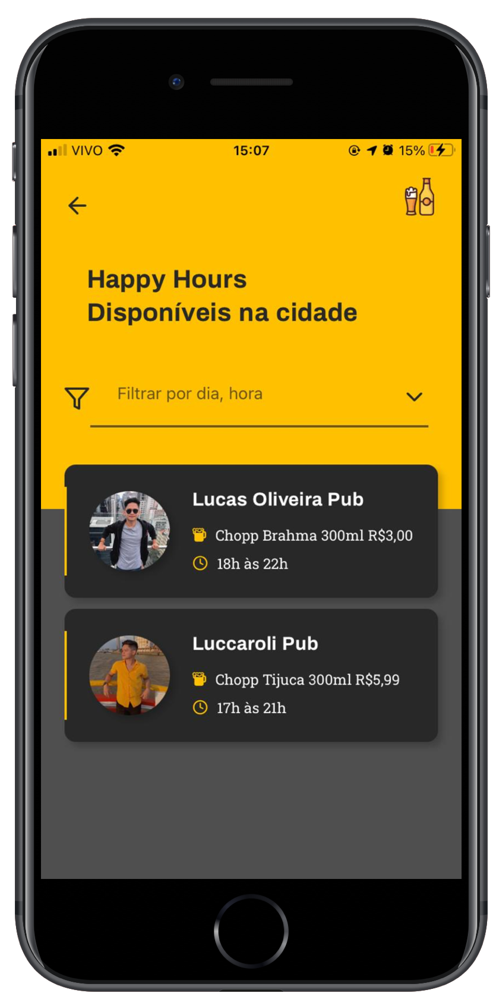

# <h1 align="center">Happy Hours<h/>

  
  

## 🚀 Tecnologias

Esse projeto foi desenvolvido com as seguintes tecnologias:

- [React Native](https://facebook.github.io/react-native/)
- [Expo](https://expo.io/)
- [TypeScript](https://www.typescriptlang.org/)
- [Styled Components](https://styled-components.com)

## 💻 Projeto 

O projeto nasceu de duas paixões, tecnologia e cerveja!, uma plataforma que lista os chopps em promoção na minha cidade, veja o video de apresentação abaixo: 

Feito com 💛️ por luccaroli 
